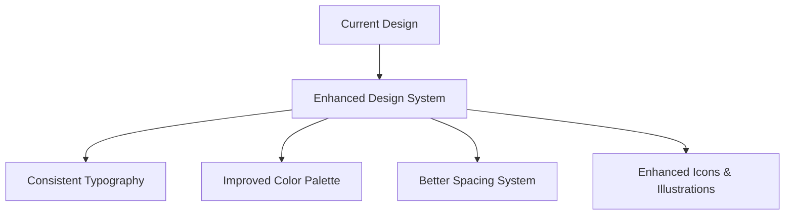
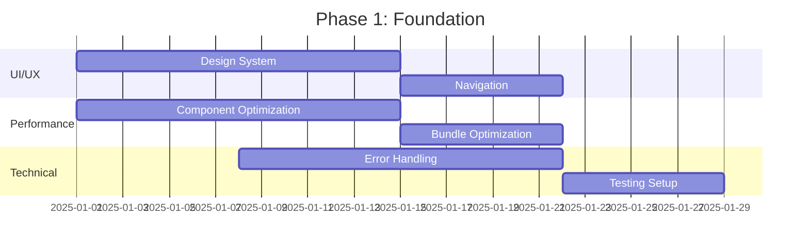

# HealthProcure - Comprehensive Improvement Roadmap

## Executive Summary

Based on my comprehensive analysis of the HealthProcure codebase, I've identified significant opportunities for enhancement across UI/UX, performance, functionality, and technical architecture. This roadmap provides actionable improvements categorized by priority and impact.

## Current System Analysis

### Strengths
- **Solid Architecture**: Well-structured Next.js 15 application with TypeScript
- **Role-Based Access**: Comprehensive hierarchical user management (base → taluka → district → state)
- **Modern UI Framework**: Radix UI components with Tailwind CSS
- **PDF Generation**: Integrated jsPDF for report generation
- **Data Integration**: Google Sheets backend with proper authentication
- **Responsive Design**: Mobile-friendly interface

### Areas for Improvement
- **Performance Optimization**: Large dataset handling and component optimization
- **User Experience**: Navigation, visual hierarchy, and interaction patterns
- **Feature Gaps**: Advanced search, notifications, workflow automation
- **Technical Debt**: Error handling, caching, and scalability concerns

---

## 🎨 UI/UX Improvements

### High Priority

#### 1. Enhanced Visual Design System


**Implementation:**
- **Custom Color Palette**: Extend beyond basic blue theme
  ```css
  :root {
    --success: 142 76% 36%;
    --warning: 38 92% 50%;
    --info: 199 89% 48%;
    --gradient-primary: linear-gradient(135deg, hsl(var(--primary)) 0%, hsl(var(--accent)) 100%);
  }
  ```
- **Typography Scale**: Implement proper type hierarchy
- **Component Variants**: Add more button, card, and input variants
- **Dark Mode**: Complete dark theme implementation

#### 2. Improved Navigation & Layout
**Current Issues:**
- No sidebar navigation for quick access
- Limited breadcrumb navigation
- No quick actions toolbar

**Proposed Solution:**
- **Collapsible Sidebar**: Role-based navigation menu
- **Breadcrumb Navigation**: Clear path indication
- **Quick Actions Bar**: Floating action button for common tasks
- **Command Palette**: Keyboard shortcuts (Ctrl+K) for power users

#### 3. Enhanced Data Visualization
**Current State:** Basic charts with limited interactivity
**Improvements:**
- **Interactive Charts**: Drill-down capabilities, tooltips, zoom
- **Dashboard Customization**: Drag-and-drop widget arrangement
- **Real-time Updates**: Live data refresh indicators
- **Export Options**: Multiple format support (PNG, SVG, PDF)

### Medium Priority

#### 4. Advanced Table Features
```typescript
// Enhanced table with sorting, filtering, and pagination
interface EnhancedTableProps {
  data: any[];
  columns: ColumnDef[];
  sorting: boolean;
  filtering: boolean;
  pagination: boolean;
  selection: boolean;
  export: boolean;
}
```

#### 5. Notification System
- **Toast Notifications**: Success, error, warning, info variants
- **In-app Notifications**: Bell icon with notification center
- **Email Notifications**: Configurable email alerts
- **Push Notifications**: Browser push for critical updates

---

## ⚡ Performance Optimizations

### High Priority

#### 1. Component Optimization
**Current Issues:**
- Large bundle sizes
- Unnecessary re-renders
- Missing memoization

**Solutions:**
```typescript
// Implement React.memo for expensive components
const OptimizedRequestTable = React.memo(RequestTable, (prevProps, nextProps) => {
  return prevProps.requests.length === nextProps.requests.length &&
         prevProps.requests.every((req, index) => req.id === nextProps.requests[index]?.id);
});

// Use useMemo for expensive calculations
const aggregatedData = useMemo(() => {
  return requests.reduce((acc, request) => {
    // Expensive aggregation logic
  }, {});
}, [requests]);
```

#### 2. Data Loading Optimization
**Current State:** All data loaded on page load
**Improvements:**
- **Lazy Loading**: Load data as needed
- **Infinite Scroll**: For large datasets
- **Caching Strategy**: Redis or in-memory caching
- **Pagination**: Server-side pagination for requests

```typescript
// Implement virtual scrolling for large lists
import { FixedSizeList as List } from 'react-window';

const VirtualizedRequestList = ({ requests }) => (
  <List
    height={600}
    itemCount={requests.length}
    itemSize={80}
    itemData={requests}
  >
    {RequestRow}
  </List>
);
```

#### 3. Bundle Optimization
- **Code Splitting**: Route-based and component-based splitting
- **Tree Shaking**: Remove unused dependencies
- **Image Optimization**: Next.js Image component usage
- **Font Optimization**: Preload critical fonts

### Medium Priority

#### 4. Database Performance
- **Indexing**: Add proper indexes to Google Sheets or migrate to database
- **Query Optimization**: Reduce API calls
- **Connection Pooling**: For database connections
- **Background Jobs**: For heavy operations

---

## 🚀 New Features & Functionality

### High Priority

#### 1. Advanced Search & Filtering
```typescript
interface SearchFilters {
  globalSearch: string;
  dateRange: { start: Date; end: Date };
  categories: ProcurementCategory[];
  priorities: Priority[];
  statuses: RequestStatus[];
  priceRange: { min: number; max: number };
  submittedBy: string[];
}

const AdvancedSearchComponent = () => {
  // Implementation with debounced search, filter persistence
};
```

#### 2. Workflow Automation
**Features:**
- **Auto-approval Rules**: Based on amount, category, or user
- **Escalation Workflows**: Automatic escalation after timeout
- **Bulk Operations**: Approve/reject multiple requests
- **Template Requests**: Pre-filled request templates

#### 3. Audit Trail & Reporting
```typescript
interface AuditEvent {
  id: string;
  entityType: 'request' | 'user' | 'system';
  entityId: string;
  action: string;
  userId: string;
  timestamp: Date;
  metadata: Record<string, any>;
  ipAddress?: string;
  userAgent?: string;
}
```

#### 4. Real-time Collaboration
- **Live Updates**: WebSocket integration for real-time data
- **Comments System**: Request-level discussions
- **Mentions**: @user notifications
- **Activity Feed**: Recent actions and updates

### Medium Priority

#### 5. Mobile App Features
- **Offline Support**: PWA with offline capabilities
- **Push Notifications**: Mobile push notifications
- **Camera Integration**: Photo attachments for requests
- **Biometric Authentication**: Fingerprint/Face ID login

#### 6. Integration Capabilities
- **API Gateway**: RESTful API for third-party integrations
- **Webhook Support**: Event-driven integrations
- **Export/Import**: CSV, Excel, JSON formats
- **Single Sign-On**: SAML/OAuth integration

---

## 🔧 Technical Improvements

### High Priority

#### 1. Error Handling & Monitoring
```typescript
// Global error boundary
class GlobalErrorBoundary extends React.Component {
  componentDidCatch(error: Error, errorInfo: ErrorInfo) {
    // Log to monitoring service
    console.error('Global error:', error, errorInfo);
    // Send to error tracking service (Sentry, LogRocket)
  }
}

// API error handling
const apiClient = {
  async request(url: string, options: RequestInit) {
    try {
      const response = await fetch(url, options);
      if (!response.ok) {
        throw new ApiError(response.status, await response.text());
      }
      return response.json();
    } catch (error) {
      // Handle network errors, timeouts, etc.
      throw new NetworkError(error.message);
    }
  }
};
```

#### 2. State Management Enhancement
**Current:** React Context + useState
**Proposed:** Zustand or Redux Toolkit for complex state

```typescript
// Zustand store example
interface AppStore {
  requests: ProcurementRequest[];
  filters: SearchFilters;
  user: User | null;
  
  // Actions
  setRequests: (requests: ProcurementRequest[]) => void;
  updateRequest: (id: string, updates: Partial<ProcurementRequest>) => void;
  setFilters: (filters: Partial<SearchFilters>) => void;
}

const useAppStore = create<AppStore>((set, get) => ({
  // Implementation
}));
```

#### 3. Testing Infrastructure
```typescript
// Unit tests with Jest + React Testing Library
describe('RequestTable', () => {
  it('should render requests correctly', () => {
    render(<RequestTable requests={mockRequests} />);
    expect(screen.getByText('Request 1')).toBeInTheDocument();
  });
});

// E2E tests with Playwright
test('user can submit a request', async ({ page }) => {
  await page.goto('/dashboard');
  await page.click('[data-testid="add-request"]');
  // Test implementation
});
```

### Medium Priority

#### 4. Security Enhancements
- **Input Validation**: Zod schemas for all inputs
- **CSRF Protection**: Cross-site request forgery protection
- **Rate Limiting**: API rate limiting
- **Audit Logging**: Comprehensive security audit logs

#### 5. DevOps & Deployment
- **CI/CD Pipeline**: GitHub Actions or similar
- **Environment Management**: Proper env variable handling
- **Monitoring**: Application performance monitoring
- **Backup Strategy**: Automated data backups

---

## 📊 Implementation Roadmap

### Phase 1: Foundation (Weeks 1-4)


**Deliverables:**
- Enhanced design system with consistent theming
- Optimized component performance
- Comprehensive error handling
- Basic testing infrastructure

### Phase 2: Core Features (Weeks 5-8)
**Focus Areas:**
- Advanced search and filtering
- Workflow automation basics
- Real-time updates
- Mobile responsiveness improvements

### Phase 3: Advanced Features (Weeks 9-12)
**Focus Areas:**
- Complete workflow automation
- Advanced reporting and analytics
- Integration capabilities
- Security enhancements

### Phase 4: Polish & Scale (Weeks 13-16)
**Focus Areas:**
- Performance fine-tuning
- Advanced mobile features
- Third-party integrations
- Production optimization

---

## 💰 Cost-Benefit Analysis

### High ROI Improvements
1. **Performance Optimization** - Immediate user satisfaction improvement
2. **Advanced Search** - Significant productivity gains
3. **Workflow Automation** - Reduces manual work by 60-80%
4. **Error Handling** - Reduces support tickets by 40%

### Medium ROI Improvements
1. **Enhanced UI/UX** - Long-term user adoption
2. **Real-time Features** - Competitive advantage
3. **Mobile Optimization** - Expanded user base
4. **Integration APIs** - Future scalability

---

## 🎯 Success Metrics

### Performance Metrics
- **Page Load Time**: < 2 seconds (currently ~4-5 seconds)
- **Time to Interactive**: < 3 seconds
- **Bundle Size**: Reduce by 30%
- **Memory Usage**: Optimize for mobile devices

### User Experience Metrics
- **Task Completion Rate**: Increase by 25%
- **User Satisfaction Score**: Target 4.5/5
- **Support Ticket Reduction**: 40% decrease
- **Feature Adoption Rate**: 80% for new features

### Business Metrics
- **Processing Time**: Reduce approval time by 50%
- **Error Rate**: < 1% system errors
- **User Retention**: 95% monthly retention
- **Scalability**: Support 10x current user base

---

## 🛠️ Technical Specifications

### Recommended Technology Additions

#### Frontend
```json
{
  "dependencies": {
    "@tanstack/react-query": "^5.0.0",
    "zustand": "^4.4.0",
    "@radix-ui/react-command": "^1.0.0",
    "react-window": "^1.8.8",
    "framer-motion": "^10.16.0",
    "@sentry/nextjs": "^7.0.0"
  }
}
```

#### Backend Enhancements
- **Database Migration**: Consider PostgreSQL or MongoDB
- **Caching Layer**: Redis for session and data caching
- **Message Queue**: Bull or Agenda for background jobs
- **File Storage**: AWS S3 or similar for attachments

#### Infrastructure
- **Monitoring**: Sentry for error tracking, Vercel Analytics
- **CDN**: Cloudflare for static asset delivery
- **Database**: Supabase or PlanetScale for managed database
- **Authentication**: Auth0 or Clerk for enterprise SSO

---

## 🚦 Risk Assessment

### High Risk Items
1. **Data Migration**: Moving from Google Sheets to database
2. **Authentication Changes**: SSO integration complexity
3. **Performance Changes**: Potential regression during optimization

### Mitigation Strategies
1. **Gradual Migration**: Implement dual-write pattern
2. **Feature Flags**: Gradual rollout of new features
3. **Comprehensive Testing**: Automated testing at all levels
4. **Rollback Plans**: Quick rollback capabilities

---

## 📋 Next Steps

### Immediate Actions (This Week)
1. **Set up monitoring**: Implement basic error tracking
2. **Performance baseline**: Measure current performance metrics
3. **Design system audit**: Document current component usage
4. **User feedback collection**: Survey current users for pain points

### Short-term Goals (Next Month)
1. **Implement Phase 1 improvements**
2. **Set up development workflow**
3. **Create component library documentation**
4. **Establish testing practices**

### Long-term Vision (Next Quarter)
1. **Complete core feature enhancements**
2. **Achieve performance targets**
3. **Launch mobile-optimized experience**
4. **Implement advanced workflow automation**

---

This roadmap provides a comprehensive path forward for enhancing the HealthProcure application. Each improvement is designed to deliver measurable value while maintaining system stability and user satisfaction.